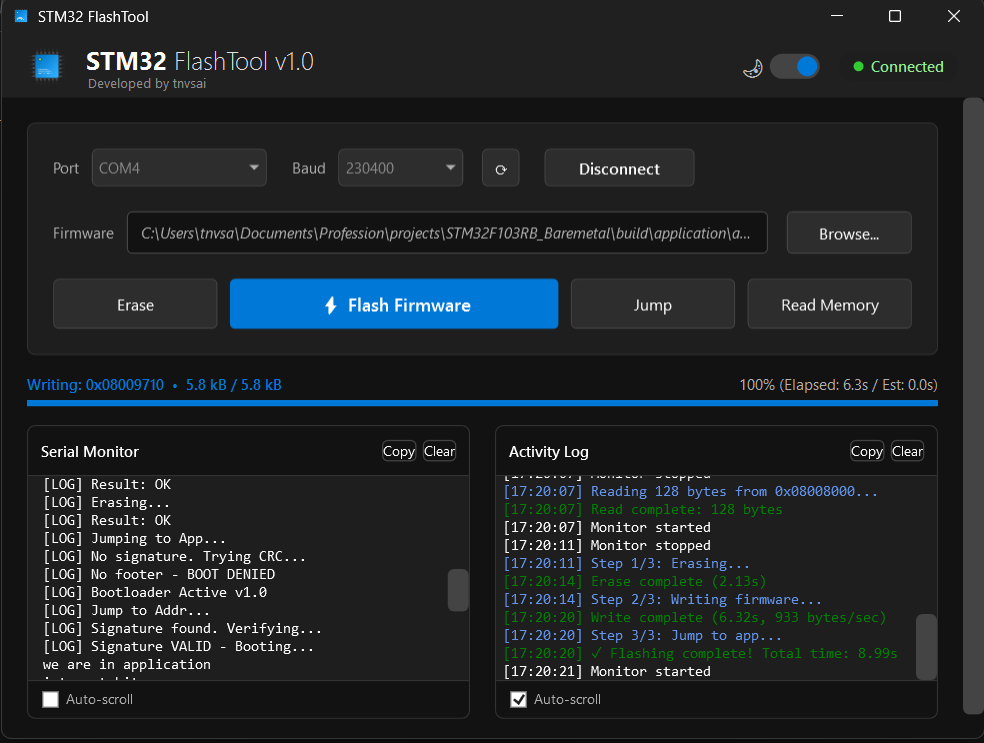

# STM32 FlashTool
> **Professional UART Bootloader Utility for STM32F103**

![STM32 FlashTool UI]!

**STM32 FlashTool** is a modern, high-performance Windows application for flashing firmware to STM32 microcontrollers via UART. Built with .NET 8 and WPF, it offers a robust alternative to complex Python scripts or heavy Electron apps.

## 🚀 Features
- **High Performance**: Optimized "Tight Loop" engine writes 64KB in ~9 seconds (vs ~90s originally).
- **Robust Protocol**: Auto-handles 128-byte chunking, 16-byte sub-chunking, and data alignment padding to prevent buffer overruns and crashes.
- **Modern UI**: Dark/Light theme, Drag-and-Drop firmware support, and Real-time progress bar.
- **Rich Logging**: Color-coded serial monitor (Blue=Info, Green=Success, Red=Error).
- **Portable**: Single `.exe` file (~12MB), no external dependencies required.

## 📦 Download & Run
You can download the latest release from the [Releases](#) tab or build it yourself.

1. Connect your **STM32F103** via USB-TTL Adapter (PA9/PA10).
2. Set Boot0 = 1, Boot1 = 0 (Bootloader Mode).
3. Reset the board.
4. Open **STM32FlashTool.exe**.
5. Select COM Port & Baud Rate (Default: 230400).
6. Click **Connect** -> **Flash Firmware**.

## 🛠️ Build Instructions

### Prerequisites
- **.NET 8 SDK**: [Download Here](https://dotnet.microsoft.com/download/dotnet/8.0)

### Quick Build (PowerShell)
```powershell
dotnet publish -c Release
```
Executable location: `bin\Release\net8.0-windows\win-x64\publish\STM32FlashTool.exe`

### Self-Contained Build (Recommended)
Builds a single `.exe` that runs on any PC (even without .NET installed):
```powershell
dotnet publish -c Release -r win-x64 --self-contained true /p:PublishSingleFile=true
```

## ⚙️ Technical Details
- **Baud Rate**: Tested up to **230400** baud.
- **Block Size**: 128 Bytes (Max frame size).
- **Throttling**: Uses "Tight Loop" writing (zero sleep) to naturally pace data transmission (~40us/byte), matching UART speed perfectly to prevent RX buffer overruns on the target.
- **Alignment**: Automatically pads firmware to even lengths (2-byte) to comport with STM32 Half-Word flash write requirements.

## 👨‍💻 Credits
**Developed by tnvsai**
v1.0.0
